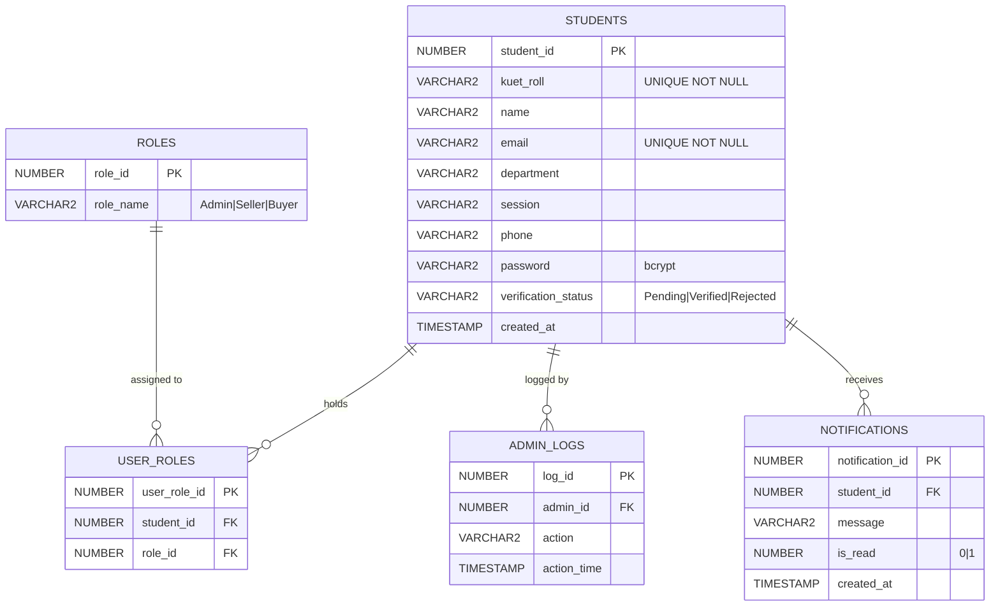
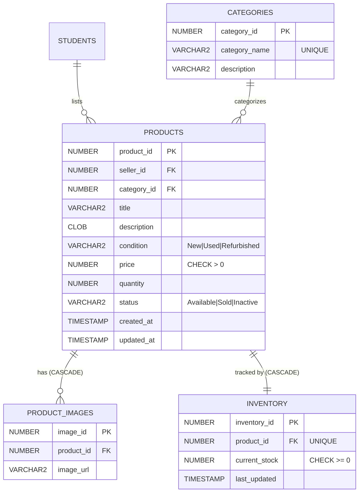
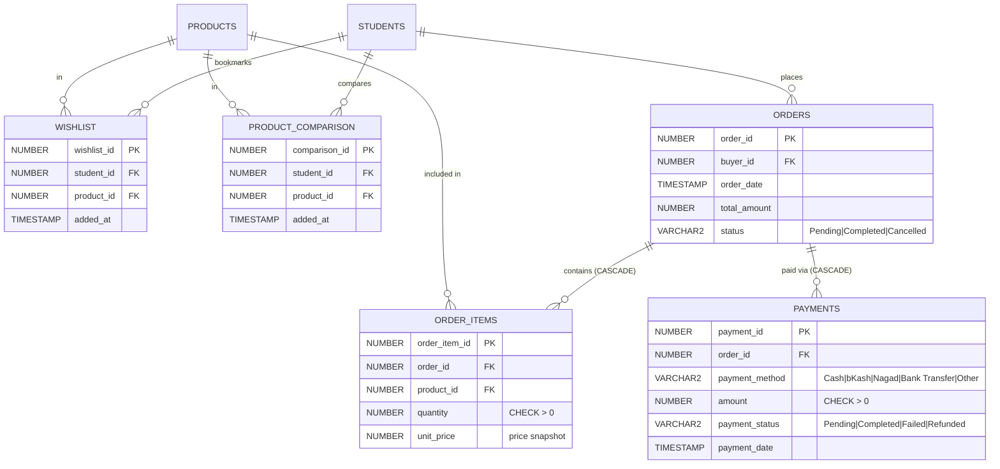
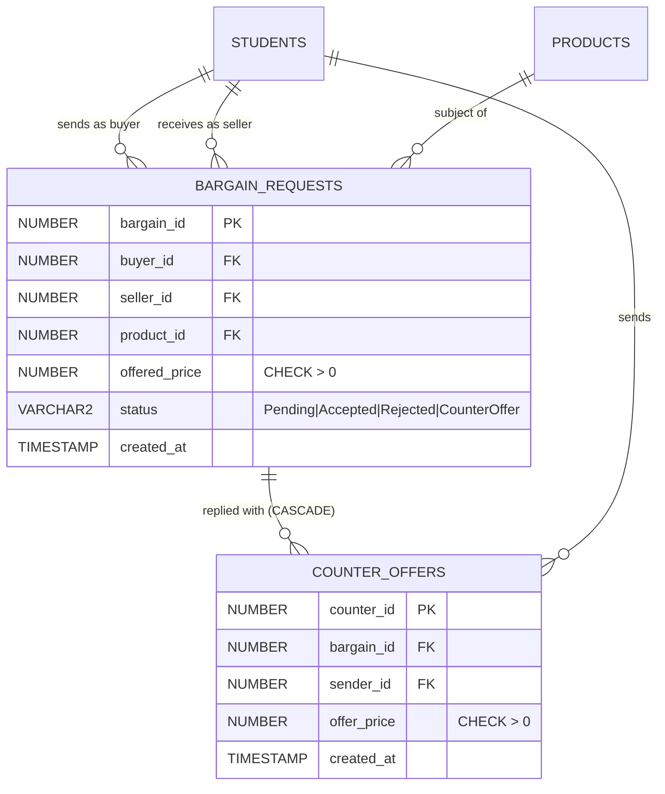
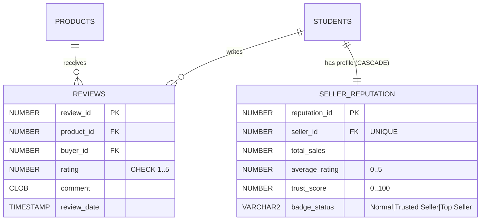

# KUET Marketplace — Project Overview

> **KUET Old & New Used Product Sale and Inventory Management System**
> Oracle 11g XE · PL/SQL · PHP OCI8 · Vanilla CSS

---

## 1. ER Diagrams

### Module 1 — Core Identity & Access Control



---

### Module 2 — Product Catalog & Inventory



---

### Module 3 — Buyer Activity: Wishlist, Orders & Payments



---

### Module 4 — Bargaining / Price Negotiation



---

### Module 5 — Reviews & Seller Reputation



---

## 2. Database Schema

### Summary — All 18 Tables

| # | Table | Columns | Relationships |
|---|---|---|---|
| 1 | `students` | 10 | Root entity — no FK parent |
| 2 | `roles` | 2 | Lookup — no FK parent |
| 3 | `user_roles` | 3 | → `students`, `roles` |
| 4 | `categories` | 3 | Lookup — no FK parent |
| 5 | `products` | 11 | → `students` (cascade), `categories` |
| 6 | `product_images` | 3 | → `products` **CASCADE** |
| 7 | `inventory` | 4 | → `products` **CASCADE UNIQUE** |
| 8 | `wishlist` | 4 | → `students`, `products` |
| 9 | `product_comparison` | 4 | → `students`, `products` |
| 10 | `bargain_requests` | 7 | → `students` ×2, `products` |
| 11 | `counter_offers` | 5 | → `bargain_requests` **CASCADE**, `students` |
| 12 | `orders` | 5 | → `students` (cascade) |
| 13 | `order_items` | 5 | → `orders` **CASCADE**, `products` |
| 14 | `payments` | 6 | → `orders` **CASCADE** |
| 15 | `reviews` | 6 | → `products`, `students` |
| 16 | `seller_reputation` | 6 | → `students` **CASCADE UNIQUE** |
| 17 | `notifications` | 5 | → `students` (cascade) |
| 18 | `admin_logs` | 4 | → `students` |

---

### `STUDENTS`

| Column | Type | Constraints |
|---|---|---|
| `student_id` | `NUMBER` | **PK** — auto from `students_seq` |
| `kuet_roll` | `VARCHAR2(20)` | **UNIQUE NOT NULL** |
| `name` | `VARCHAR2(255)` | NOT NULL |
| `email` | `VARCHAR2(255)` | **UNIQUE NOT NULL** |
| `department` | `VARCHAR2(100)` | NOT NULL |
| `session` | `VARCHAR2(20)` | NOT NULL |
| `phone` | `VARCHAR2(20)` | nullable |
| `password` | `VARCHAR2(255)` | NOT NULL (bcrypt) |
| `verification_status` | `VARCHAR2(20)` | DEFAULT `'Pending'` — CHECK IN `('Pending','Verified','Rejected')` |
| `created_at` | `TIMESTAMP` | auto-set by trigger |

**Indexes:** `idx_students_email`, `idx_students_kuet_roll`

---

### `PRODUCTS`

| Column | Type | Constraints |
|---|---|---|
| `product_id` | `NUMBER` | **PK** |
| `seller_id` | `NUMBER` | **FK** → `students` ON DELETE CASCADE |
| `category_id` | `NUMBER` | **FK** → `categories` |
| `title` | `VARCHAR2(255)` | NOT NULL |
| `description` | `CLOB` | nullable |
| `condition` | `VARCHAR2(20)` | CHECK IN `('New','Used','Refurbished')` |
| `price` | `NUMBER(12,2)` | CHECK `price > 0` |
| `quantity` | `NUMBER` | DEFAULT `1`, CHECK `>= 0` |
| `status` | `VARCHAR2(20)` | DEFAULT `'Available'` — CHECK IN `('Available','Sold','Inactive')` |
| `created_at` | `TIMESTAMP` | auto by trigger |
| `updated_at` | `TIMESTAMP` | auto-updated by trigger on every UPDATE |

**Indexes:** `idx_products_title` *(function-based: `LOWER(title)`)*, `idx_products_category`, `idx_products_seller`

---

### `INVENTORY`

| Column | Type | Constraints |
|---|---|---|
| `inventory_id` | `NUMBER` | **PK** |
| `product_id` | `NUMBER` | **UNIQUE FK** → `products` CASCADE |
| `current_stock` | `NUMBER` | DEFAULT `0`, CHECK `>= 0` |
| `last_updated` | `TIMESTAMP` | auto-updated by trigger |

> **Auto-created** by trigger `trg_auto_inventory` when a product row is inserted.

---

### `BARGAIN_REQUESTS`

| Column | Type | Constraints |
|---|---|---|
| `bargain_id` | `NUMBER` | **PK** |
| `buyer_id` | `NUMBER` | **FK** → `students` CASCADE |
| `seller_id` | `NUMBER` | **FK** → `students` |
| `product_id` | `NUMBER` | **FK** → `products` CASCADE |
| `offered_price` | `NUMBER(12,2)` | CHECK `> 0` |
| `status` | `VARCHAR2(20)` | DEFAULT `'Pending'` — CHECK IN `('Pending','Accepted','Rejected','CounterOffer')` |
| `created_at` | `TIMESTAMP` | auto-set |

**Index:** `idx_bargain_product`

---

### `ORDERS` & `ORDER_ITEMS`

| Column | Table | Constraints |
|---|---|---|
| `order_id` | `orders` | **PK** |
| `buyer_id` | `orders` | **FK** → `students` |
| `total_amount` | `orders` | DEFAULT `0`, CHECK `>= 0` |
| `status` | `orders` | CHECK IN `('Pending','Completed','Cancelled')` |
| `order_item_id` | `order_items` | **PK** |
| `order_id` | `order_items` | **FK** → `orders` **CASCADE** |
| `product_id` | `order_items` | **FK** → `products` |
| `quantity` | `order_items` | CHECK `> 0` |
| `unit_price` | `order_items` | CHECK `> 0` — price snapshot at purchase time |

**Index:** `idx_orders_buyer`

---

### `REVIEWS` & `SELLER_REPUTATION`

| Column | Table | Constraints |
|---|---|---|
| `review_id` | `reviews` | **PK** |
| `rating` | `reviews` | `NUMBER(2,1)` — CHECK `BETWEEN 1 AND 5` |
| `buyer_id` × `product_id` | `reviews` | **UNIQUE** — one review per buyer per product |
| `seller_id` | `seller_reputation` | **UNIQUE FK** → `students` CASCADE |
| `trust_score` | `seller_reputation` | `NUMBER(5,2)` — CHECK `BETWEEN 0 AND 100` |
| `badge_status` | `seller_reputation` | CHECK IN `('Normal','Trusted Seller','Top Seller')` |

**Trust Score Formula:**
```
trust_score = (avg_rating / 5) × 60  +  (MIN(total_sales, 50) / 50) × 40
```

**Indexes:** `idx_reviews_product`

---

### Complete Index Inventory

| Index | Table / Column | Purpose |
|---|---|---|
| `idx_students_email` | `students.email` | Login lookup |
| `idx_students_kuet_roll` | `students.kuet_roll` | Verification & uniqueness |
| `idx_products_title` | `LOWER(products.title)` | Case-insensitive keyword search |
| `idx_products_category` | `products.category_id` | Category browse filter |
| `idx_products_seller` | `products.seller_id` | Seller's own listings |
| `idx_bargain_product` | `bargain_requests.product_id` | Bargain lookups per product |
| `idx_orders_buyer` | `orders.buyer_id` | Order history page |
| `idx_reviews_product` | `reviews.product_id` | Rating aggregation |
| `idx_admin_logs_admin` | `admin_logs.admin_id` | Admin audit filter |
| `idx_admin_logs_time` | `admin_logs.action_time` | Chronological audit queries |

---

## 3. Features & Stack

### Technology Stack

| Layer | Technology |
|---|---|
| **RDBMS** | Oracle Database 11g Express Edition (XE) |
| **Business Logic** | Oracle PL/SQL — Packages, Procedures, Functions, Triggers |
| **DB Client** | Oracle Instant Client 11.2 (Windows x64) |
| **Web Language** | PHP 8.x (procedural — no framework) |
| **DB Driver** | `php_oci8` extension (`php_oci8_11g.dll`) |
| **Styling** | Vanilla CSS (custom dark-mode design system) |
| **Web Server** | Apache or PHP Built-in Server |
| **Version Control** | Git |

---

### PL/SQL Object Inventory

| Object | Count | Names |
|---|---|---|
| **Sequences** | 18 | One per table |
| **Auto-PK Triggers** | 18 | One `BEFORE INSERT` per table |
| **Business Triggers** | 4 | `trg_auto_inventory`, `trg_order_reduce_stock`, `trg_review_update_reputation`, `trg_admin_audit` |
| **Packages** | 5 | `pkg_students`, `pkg_products`, `pkg_orders`, `pkg_bargain`, `pkg_reputation` |
| **Views** | 4 | `view_product_details`, `view_trusted_sellers`, `view_order_summary`, `view_inventory_status` |
| **Functions** | 4 | `get_seller_rating`, `get_total_sales`, `calculate_trust_score`, `get_product_stock` |
| **Indexes** | 10 | Performance-optimized, including 1 function-based |

---

### Features by Role

#### 👑 Admin

| Feature | PL/SQL / Object Used |
|---|---|
| Admin Dashboard (stats) | Direct queries on all tables |
| Student Verification (Approve/Reject) | `pkg_students.verify_student` |
| Student Deactivation | `pkg_students.deactivate_student` |
| Product Moderation (delete any) | `pkg_products.delete_product` |
| View All Orders | `view_order_summary` |
| Inventory Overview | `view_inventory_status` |
| Audit Log Browser | `admin_logs` + `trg_admin_audit` |
| Revenue Reports by Category | `10_query_demonstrations.sql` GROUP BY query |

#### 🏪 Seller (Verified Students Who List)

| Feature | PL/SQL / Object Used |
|---|---|
| List New Product | `pkg_products.add_product` |
| Edit Own Product | `pkg_products.edit_product` |
| Delete Own Product | `pkg_products.delete_product` |
| Restock Inventory | `pkg_products.update_stock` (row-locked) |
| Inventory Dashboard | `view_inventory_status` |
| Accept / Reject Bargain | `pkg_bargain.accept_offer`, `pkg_bargain.reject_offer` |
| Send Counter-Offer | `pkg_bargain.send_counter_offer` |
| View Reputation & Badge | `view_trusted_sellers`, `pkg_reputation` |

#### 🛒 Buyer (All Verified Students)

| Feature | PL/SQL / Object Used |
|---|---|
| Search & Filter Products | `view_product_details` + indexed `LOWER(title)` |
| Add to Wishlist | Direct INSERT to `wishlist` (UNIQUE guard) |
| Compare Products | Direct INSERT to `product_comparison` |
| Send Bargain Offer | `pkg_bargain.send_offer` |
| Place Order | `pkg_orders.process_order` (SAVEPOINT transaction) |
| Cancel Order | `pkg_orders.cancel_order` (stock restore + ROLLBACK) |
| Leave Review | INSERT to `reviews` → `trg_review_update_reputation` fires |
| View Notifications | `notifications` table |
| View Order History | `view_order_summary` |

---

### SQL Concept Coverage

| SQL Concept | Demonstrated By |
|---|---|
| INNER JOIN | Products + seller + category |
| LEFT JOIN | Students with wishlist count (0 if empty) |
| RIGHT JOIN | All categories including empty ones |
| FULL OUTER JOIN | Products ↔ bargain requests (gaps both sides) |
| SELF JOIN | Students in same department & session |
| CROSS JOIN | Category × Condition matrix |
| NATURAL JOIN | Comparison items × products |
| UNION | All active buyers OR sellers |
| INTERSECT | Students who are both buyer and seller |
| MINUS | Sellers with listings but zero sales |
| LIKE | Keyword search (`LOWER(title) LIKE '%..%'`) |
| REGEXP_SUBSTR | Extract cohort year from KUET roll |
| GROUP BY | Revenue per product category |
| HAVING | Sellers with 2+ active listings |
| Nested Query | Products below category average price |
| Correlated Query | Buyers who bargained before ordering |
| COMMIT | Successful order → full commit |
| ROLLBACK | Insufficient stock → full rollback |
| SAVEPOINT | Order cancel → partial rollback + stock restore |

---

### Data Seed (Demo Accounts)

| Roll | Name | Role | Password |
|---|---|---|---|
| `ADMIN-001` | Admin User | Admin | `password123` |
| `1907043` | Ariful Islam | Seller + Buyer | `password123` |
| `1904021` | Tahmina Akter | Seller + Buyer | `password123` |
| `2007055` | Rakib Hasan | Seller + Buyer | `password123` |
| `2104077` | Nusrat Jahan | Buyer | `password123` |
| `2201032` | Sabbir Ahmed | Buyer | `password123` |
| `2305011` | Mithila Roy | Pending | `password123` |
